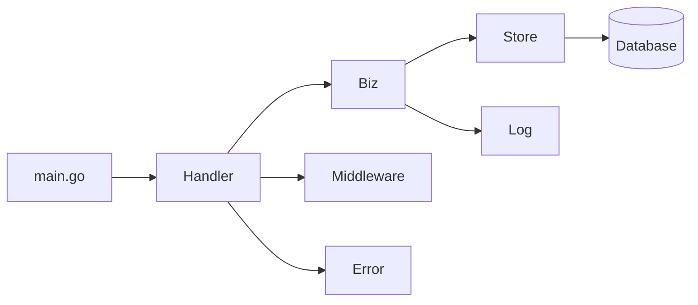

# 01-项目目录与架构分析

## 1. 学习目标

- 理解 `miniblog` 项目的整体目录组织方式。
- 能够根据源码结构快速定位各类功能代码（如入口、业务、数据、配置等）。

---

## 2. 核心文件与目录

```
miniblog/
├── api/           # OpenAPI/Swagger 文档
├── build/         # 构建相关文件（如 Dockerfile）
├── cmd/           # 应用程序入口（main.go）
├── configs/       # 配置文件与数据库初始化脚本
├── deployments/   # Kubernetes 部署文件
├── docs/          # 项目文档
├── examples/      # 示例代码
├── internal/      # 业务核心代码（分层架构核心）
├── pkg/           # 可复用的外部包
├── scripts/       # 辅助脚本
├── go.mod         # Go 依赖管理
├── README.md      # 项目说明
├── MakeFile       # 项目自动构建命令脚本
```

- `cmd/mb-apiserver/main.go` —— 服务启动入口
- `internal/apiserver/` —— API 服务核心实现（分层架构核心）
  - `handler/` —— 控制器层（HTTP/gRPC 处理）
  - `biz/` —— 业务逻辑层
  - `model/` —— 数据结构与 ORM 模型
  - `store/` —— 数据访问层
- `internal/pkg/` —— 通用基础设施与中间件
  - `middleware/` —— Gin/gRPC 中间件
  - `log/` —— 日志系统（询问了作者由于有些业务相关的内容所以放在 internal 目录）
  - `errno/` —— 错误码与错误处理
- `configs/mb-apiserver.yaml` —— 主配置文件
- `Makefile` —— 构建与开发脚本
- `api/openapi/` —— OpenAPI/Swagger 接口规范

---

## 3. 架构说明

### 3.1 入口层（cmd/）

- **作用**：应用启动入口，负责加载配置、初始化依赖、启动服务。
- **相关文件**：`cmd/mb-apiserver/main.go`
- **定位方法**：查找 `main.go`，一般在 `cmd/` 下。

### 3.2 接口层（api/、pkg/api/）

- **作用**：定义对外 API 规范（RESTful、gRPC），便于前后端协作和自动生成文档。
- **相关文件**：`api/openapi/miniblog/v1/openapi.yaml`、`pkg/api/miniblog/v1/*.proto`
- **定位方法**：查找 `api/` 目录下的 OpenAPI/Swagger 文档和 Protobuf 文件。

### 3.3 处理层（internal/apiserver/handler/）

- **作用**：路由分发、参数校验、调用业务逻辑。
- **相关文件**：`internal/apiserver/handler/http/user.go`、`internal/apiserver/handler/grpc/user.go`
- **定位方法**：根据协议（HTTP/gRPC）在 handler 子目录下查找对应功能文件。
- **http/**：HTTP 路由与处理器，使用 Gin 框架，负责参数校验、调用业务逻辑。
- **grpc/**：gRPC 路由与处理器，负责 gRPC 请求的分发与处理。
  **示例：**  
  `internal/apiserver/handler/http/user.go` 负责用户相关 HTTP 接口的处理，如注册、登录、信息查询等。

### 3.4 业务层（internal/apiserver/biz/）

- **作用**：实现核心业务逻辑，组织业务流程。
- **相关文件**：`internal/apiserver/biz/v1/user/`、`internal/apiserver/biz/v1/post/`
- **定位方法**：在 `biz/` 下按版本和业务类型查找。
- **v1/**、**v2/**：业务逻辑实现，支持多版本演进。
- **biz.go**：业务逻辑聚合与组织。
  **示例：**  
  `internal/apiserver/biz/v1/user/` 实现用户注册、登录、信息更新等核心业务流程。

### 3.5 数据层（internal/apiserver/store/）

- **作用**：封装数据持久化操作，屏蔽底层存储细节（如内存/MySQL）。
- **相关文件**：`internal/apiserver/store/user.go`、`internal/apiserver/store/post.go`
- **定位方法**：在 `store/` 下查找与数据相关的操作实现。
- **store.go**：定义数据访问接口，屏蔽底层存储细节。
- **post.go/user.go**：实现具体的数据操作（如内存或 MySQL）。
- **concrete_post.go**：具体的存储实现。
  **示例：**  
  `store.UserStore` 提供用户数据的增删改查接口，Biz 层通过接口调用，无需关心底层实现。

### 3.6 模型层（internal/apiserver/model/）

- **作用**：定义数据结构，GORM 实体与数据库表映射。
- **相关文件**：`internal/apiserver/model/user.gen.go`、`internal/apiserver/model/post.gen.go`
- **定位方法**：在 `model/` 下查找以 `.gen.go` 结尾的模型定义文件。
- **user.gen.go/post.gen.go**：GORM 实体定义，映射数据库表结构。
- **hook.go**：GORM 钩子函数，处理模型生命周期事件。

### 3.7 配置与部署（configs/、deployments/）

- **作用**：集中管理应用配置、数据库初始化脚本、K8s 部署文件等。
- **相关文件**：`configs/mb-apiserver.yaml`、`configs/miniblog.sql`、`deployments/mb-apiserver-deployment.yaml`
- **定位方法**：在 `configs/` 和 `deployments/` 下查找对应配置和部署文件。

### 3.8 公共包（internal/pkg/）

- **作用**：日志、错误码、中间件、常量等通用能力，提升代码复用性。
- **相关文件**：`internal/pkg/log/`、`internal/pkg/errno/`、`internal/pkg/middleware/`
- **定位方法**：在 `internal/pkg/` 下按功能查找。
- **errno/**：错误码定义与管理。
- **log/**：日志封装。
- **middleware/**：HTTP/gRPC 中间件，如认证、授权、请求 ID 等。
- **contextx/**：自定义上下文管理。

---

## 4. 设计模式

- **分层架构模式**：入口-控制器-业务-数据-基础设施，关注点分离。
- **依赖注入（wire.go）**：通过 Google Wire 实现依赖关系自动注入，提升可测试性和解耦性。
- **选项模式（Options Pattern）**：如日志、配置等模块初始化时常用。
- **中间件模式**：Gin/gRPC 中间件链式处理请求。

---

## 5. 模块间交互

- **入口层** 依赖 **配置、日志、控制器**。
- **控制器层** 调用 **业务层**，并依赖 **中间件、错误处理**。
- **业务层** 调用 **数据层**，并依赖 **日志、错误处理**。
- **数据层** 依赖 **数据库配置、ORM 工具**。
- **基础设施层** 为所有层提供通用能力。



---
